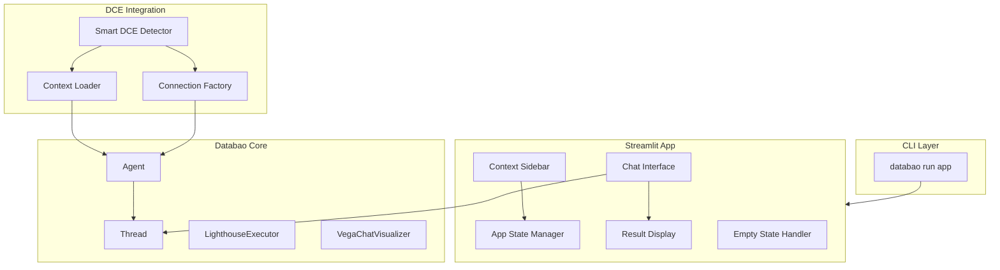
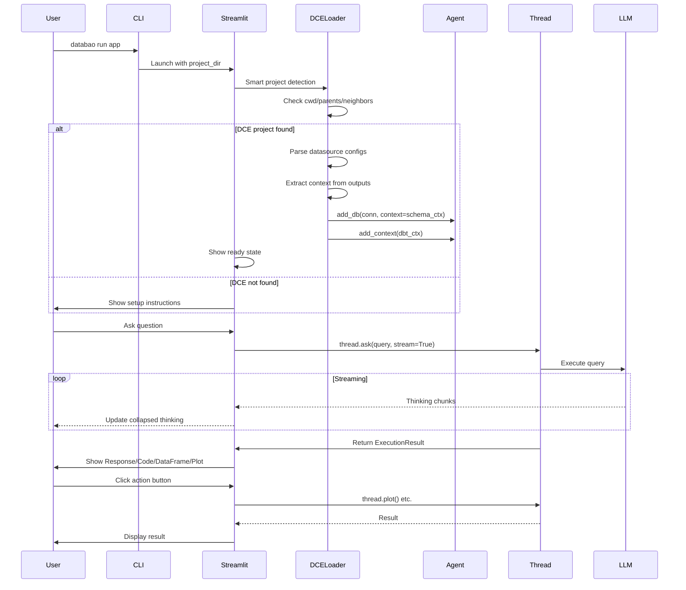

# Databao Streamlit Web Interface (v0.1)

## Scope

**v0.1 (this plan):** Assumes DCE project exists and is set up. If not found, shows instructions to set it up via nemory CLI.

**v0.2 (future):** Add UI for setting up DCE project, route user through guided setup.

## Architecture Overview




## Key Files to Create

| File | Purpose |

|------|---------|

| `[databao/cli.py](databao/cli.py)` | Click CLI with `run app` command |

| `[databao/dce/project.py](databao/dce/project.py)` | DCE project detection and validation |

| `[databao/dce/context.py](databao/dce/context.py)` | Extract context from DCE outputs |

| `[databao/dce/connections.py](databao/dce/connections.py)` | Create DB connections from DCE configs |

| `[streamlit_app/app.py](streamlit_app/app.py)` | Main Streamlit application |

| `[streamlit_app/components/chat.py](streamlit_app/components/chat.py)` | Chat interface with streaming |

| `[streamlit_app/components/results.py](streamlit_app/components/results.py)` | Result display with foldable sections |

| `[streamlit_app/components/sidebar.py](streamlit_app/components/sidebar.py)` | Context sidebar |

## Implementation Details

### 1. CLI Entry Point

Create a Click-based CLI in `[databao/cli.py](databao/cli.py)`:

- `databao run app` - launches Streamlit app
- No project-dir option in CLI (project selection happens in UI)
- Simple wrapper that runs `streamlit run streamlit_app/app.py`

### 2. DCE Integration Layer

**Smart Project Detection** (`[databao/dce/project.py](databao/dce/project.py)`):

1. Check current directory for `nemory.ini` + `src/`
2. Check parent directories (up to 3 levels)
3. Check neighboring directories (siblings of cwd)
4. If candidates found, suggest them to user
5. Allow manual path selection via sidebar/dialog
6. Store selected path in session state

Returns:

- `DCEProjectStatus.VALID` - project found with build outputs
- `DCEProjectStatus.NO_BUILD` - project found but no `output/` run
- `DCEProjectStatus.NOT_FOUND` - no project detected

**Context Extraction** (`[databao/dce/context.py](databao/dce/context.py)`):

- Parse `context_*.yaml` files to extract per-database schema context (for `add_db(context=...)`)
- Parse `dbt-introspections/*.yaml` for dbt model descriptions (for `add_context()`)
- Format context as markdown for LLM consumption

**Connection Factory** (`[databao/dce/connections.py](databao/dce/connections.py)`):

- Parse configs from `src/connections/databases/*.yaml` (or `src/databases/`)
- Use DCE's Pydantic config models where available
- Create DuckDB connections directly, SQLAlchemy engines for Postgres/MySQL/etc.
- Return tuples of (connection, context_text) for `agent.add_db(connection, context=...)`

### 3. Streamlit Application

**Main App** (`[streamlit_app/app.py](streamlit_app/app.py)`):

- Initialize DCE project and load sources on startup
- Manage session state for Agent and Thread
- Route to appropriate UI based on project status

**Chat Interface** (`[streamlit_app/components/chat.py](streamlit_app/components/chat.py)`):

- Use `st.chat_input` and `st.chat_message` for chat UI
- Stream thinking traces in real-time (collapsed by default, like ChatGPT)
- Use `st.expander` for thinking sections with "Thinking..." label while active
- When streaming completes, show results via ResultDisplay component

**Result Display** (`[streamlit_app/components/results.py](streamlit_app/components/results.py)`):

Display execution results in foldable sections (matching Databao notebook defaults):

| Section | Expanded by Default | Notes |

|---------|---------------------|-------|

| Thinking | Collapsed | Full reasoning trace, tool calls |

| Response | Expanded (if no viz) | `thread.text()` content |

| Code | Collapsed | SQL/generated code |

| DataFrame | Expanded (if no viz) | `st.dataframe(thread.df())` |

| Visualization | Expanded (if present) | `st.altair_chart` or `st.vega_lite_chart` |

**Action Buttons** (only for `thread.ask()` responses):

Buttons extend the same message rather than creating a new one. Only show buttons for available/applicable actions:

| Button | When to Show | Action |

|--------|--------------|--------|

| "Show Data" | `result.df is not None` | Expand/scroll to DataFrame section |

| "Show Code" | `result.code is not None` | Expand/scroll to Code section |

| "Generate Plot" | No plot was generated yet | Call `thread.plot()`, update message with visualization |

Notes:

- "Show Text" not needed - Response section is always visible by default
- "Generate Plot" triggers LLM call if `should_visualize` was False or no visualization prompt was provided
- When plot is generated, button disappears and Visualization section appears
- Clicking Data/Code buttons just expands those sections (no LLM call needed)

**Sidebar** (`[streamlit_app/components/sidebar.py](streamlit_app/components/sidebar.py)`):

- Show project name and path
- List connected sources with type indicators (DuckDB, Postgres, etc.)
- Display status: loading/ready/error
- DCE project path selector (for when auto-detection finds multiple candidates)

**Empty/Error States**:

When DCE project not found:

```
No DCE project detected.

To set up a project, run:
  nemory init
  nemory datasource add
  nemory build

Then reload this page.

Or select an existing project path below.
[Path selector input]
```

### 4. Streaming Adapter

Adapt `TextStreamFrontend` for Streamlit (`[streamlit_app/streaming.py](streamlit_app/streaming.py)`):

- **Everything streamed via `TextStreamFrontend.writer` goes into Thinking section**
  - The `======== <THINKING> ========` markers are just visual decorations
  - All LLM reasoning, tool calls, tool outputs are "thinking"
- Stream content to a collapsed `st.expander` in real-time
- After streaming completes, the final `ExecutionResult` provides the structured output (text, code, df, meta)
- No need to parse/separate thinking from response - they come from different sources:
  - Thinking = streamed content
  - Results = `ExecutionResult` object after execution

## Data Flow




## Chat Message Structure

Each assistant message from `thread.ask()` displays:

```
+------------------------------------------+
| Thinking...                         [v]  |  <- Collapsed expander
|------------------------------------------|
| (All streamed content: reasoning,        |
|  tool calls, tool outputs)               |
+------------------------------------------+
| Response                            [^]  |  <- Expanded by default
|------------------------------------------|
| "Here are the KPI metrics..."            |
+------------------------------------------+
| Code                                [v]  |  <- Collapsed (if code exists)
|------------------------------------------|
| SELECT ... FROM ...                      |
+------------------------------------------+
| Data                                [^]  |  <- Expanded if no plot (if df exists)
|------------------------------------------|
| [DataFrame display]                      |
+------------------------------------------+
| Visualization                       [^]  |  <- Expanded (if plot exists)
|------------------------------------------|
| [Chart]                                  |
+------------------------------------------+
| [Data] [Code] [Generate Plot]            |  <- Only relevant buttons
+------------------------------------------+
```

Button visibility:

- "Data" shown only if `df is not None` and Data section is collapsed
- "Code" shown only if `code is not None` and Code section is collapsed  
- "Generate Plot" shown only if no visualization was generated yet

When "Generate Plot" is clicked:

- Button disappears
- LLM generates visualization
- Visualization section appears in the same message

## Dependencies

Add to `[pyproject.toml](pyproject.toml)`:

- `click>=8.0.0` (for CLI)
- `streamlit>=1.40.0` (already in optional deps)
- `pyyaml>=6.0` (for parsing DCE configs)

## Notes

- **CLI is minimal**: Just launches Streamlit, no options. Will be replaced by central databao CLI later.
- **Project selection in UI only**: Smart detection + manual path selector in sidebar.
- **DCE integration is soft**: Imports nemory only when needed. Falls back gracefully.
- **v0.1 requires existing DCE**: App launches but shows instructions if project not found.
- **v0.2 will add setup UI**: Guided flow for creating DCE project from Streamlit.
- **Thinking = all streamed content**: Everything from `TextStreamFrontend.writer` goes in collapsed Thinking section.
- **Action buttons extend messages**: Clicking "Generate Plot" updates the same message, doesn't create new one.
- **Conditional buttons**: Only show buttons for available data (df/code exists) or missing features (no plot yet).

